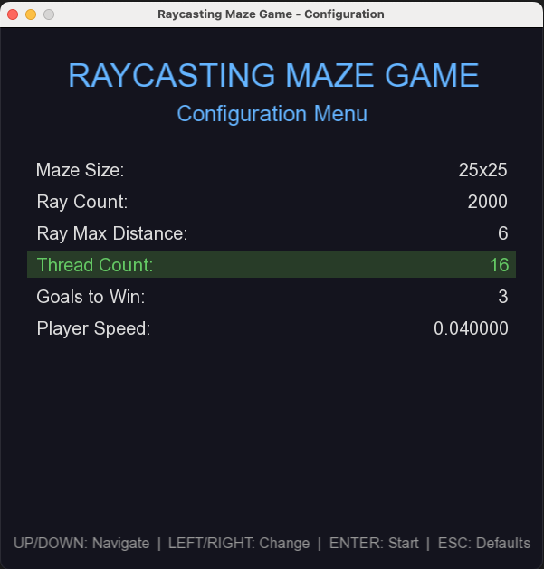
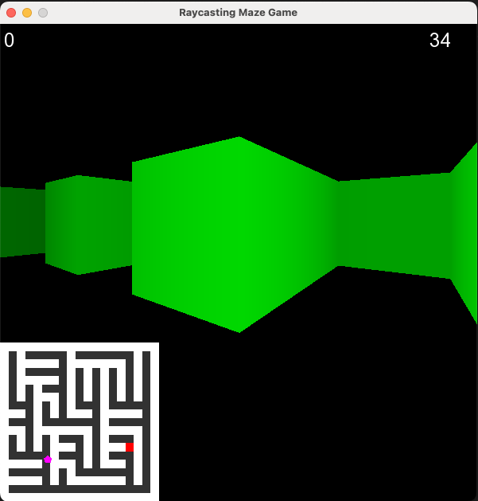
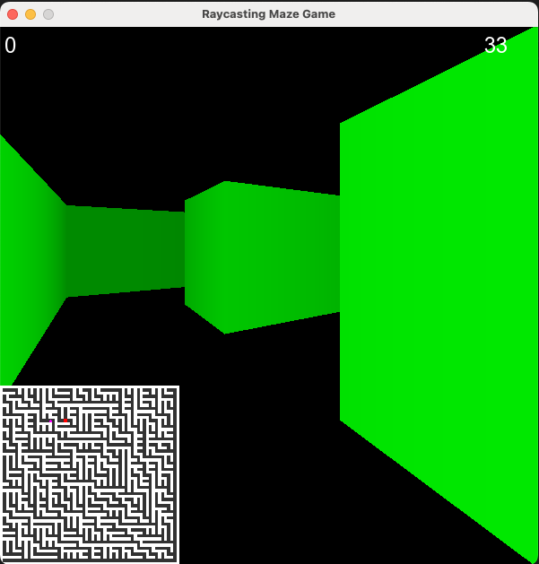

# Raycasting Maze Game

A real-time 3D maze game implemented in C++ using SFML with multithreaded raycasting.

## Features

- **Configurable Settings** - Customize maze size, ray count, threads, and more before starting
- **Procedural Maze Generation** - Unique maze every time
- **Multithreaded Raycasting** - Uses POSIX threads for parallel rendering
- **Thread-safe Rendering** - Mutex-protected drawing operations
- **Real-time Player Controls** - Smooth movement and collision detection
- **Timer and Score System** - Track your progress
- **Minimap View** - See your position in the maze

## Screenshots

### Configuration Menu

### Gameplay

## Controls

### Configuration Menu
| Key | Action |
|-----|--------|
| ↑ / ↓ | Navigate between options |
| ← / → | Change selected value |
| Enter | Start game |
| Esc | Reset to defaults and start |

### In-Game
| Key | Action |
|-----|--------|
| W | Move forward |
| A | Rotate left |
| D | Rotate right |
| U | Regenerate maze |

## Configurable Options

| Setting | Description | Range | Default |
|---------|-------------|-------|---------|
| Maze Size | Size of the maze grid | 11×11 to 51×51 | 25×25 |
| Ray Count | Number of rays for rendering | 100 to 2000 | 600 |
| Ray Max Distance | Maximum visibility distance | 4 to 20 | 8 |
| Thread Count | Parallel raycasting threads | 1 to 16 | 7 |
| Goals to Win | Goals needed to reset | 1 to 10 | 3 |
| Player Speed | Movement speed | 0.02 to 0.15 | 0.05 |

## Project Structure

| File | Description |
|------|-------------|
| `main.cpp` | Entry point, shows configuration menu |
| `config.h/.cpp` | Configuration menu and settings struct |
| `game.h/.cpp` | Main game class and game loop |
| `maze.h/.cpp` | Maze generation and minimap rendering |
| `player.h/.cpp` | Player movement and multithreaded raycasting |
| `ray.h/.cpp` | Ray casting algorithm (DDA) |

## Requirements

- C++23 compatible compiler
- SFML 3.0+
- POSIX threads (pthread)
